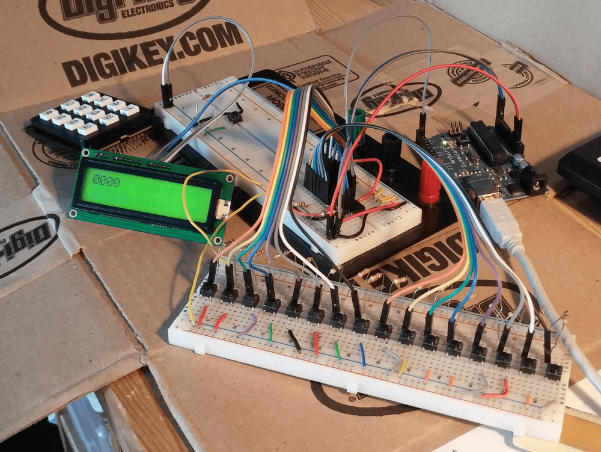
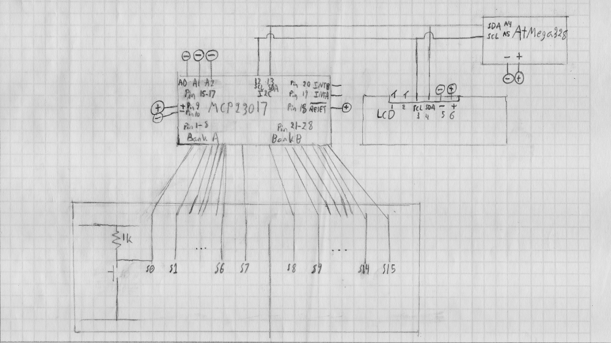
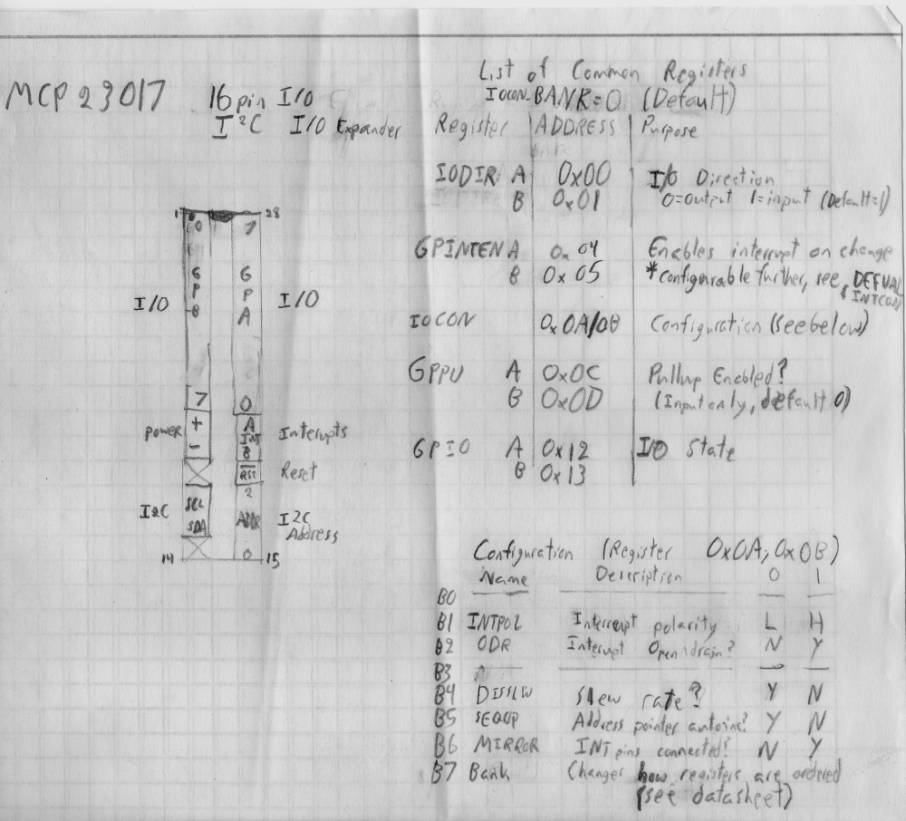
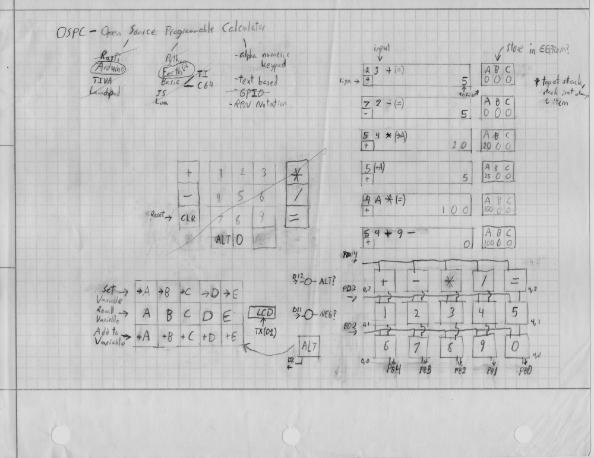

title: avRPN
description: Attempt at creating a reverse polish notation calculator from an Arduino.
template: template.html

---

# AVR RPN Calculator
An AVR [RPN](https://en.wikipedia.org/wiki/Reverse_Polish_notation){target="\_bank"} Calculator

{class="primary" style="width:80%;display:block;"}

<i class="fa fa-gitlab"></i> Code: <a target="_blank" href="https://gitlab.com/wasv/avr-rpn-calc">wasv/avr-rpn-calc</a>

## Updates:
### November 2018

This project has been on hold for a while. However, I recently reused the MCP23017 in another project to try and make a 64 button matrix keypad. While working on that project, I ran into an issue similar to the one that stopped this project. It turns out that the IO expander resets when every input pin on a port is pulled low. This does not occur when all but one pin is pulled low. This may be due to excessive current draw through the part, or some other power issue.

### January 20th, 2016

No functional updates this time, just some more documentation as I prepare to return to college. The basic schematic below should (hopefully) be enough for me to reassemble this project after getting back to college. In addition, I have an updated photo of the hardware layout and a brief 'cheatsheet' for the MCP23017 IO expander I've been using. I got 4 of them for $1.20 each at [Digikey](https://www.digikey.com/product-detail/en/MCP23017-E%2FSP/MCP23017-E%2FSP-ND/894272){target="_blank"}

{class="primary" style="width:80%;display:block;"}

{class="primary" style="width:80%;display:block;"}

### January 18th, 2016

I've worked out the remaining bugs in keypad reading code. It turns out that the prebuilt keypad I was using was causing an issue. After I rebuilt the keypad circuit with 16 individual buttons, each with a pullup resistor, I was able to work out the remaining software bugs. I went through a few different iterations, gradually adding more debugging code. One iteration involved reading each register on the IO expander hoping to figure out what the state of the device was. It was only after I simplified the code, essentially starting over, that I could figure out how to read the state properly.

The current code displays the hex value read from IO expander and the keycode it matches. I'm still working on a way to get interrupts to work, but I should be able to get my final code to work without them. The code in the [keys folder](https://gitlab.com/wasv/avr-rpn-calc/tree/master/keys){target="_blank"}.

### January 14th, 2016

The parts came in for the new keypad design. I assembled a circuit with the IO expander and LCD connected to the Arduino through the same i2c bus. Communication appears to be working, but the IO expander isn't picking up any button presses. I spent most of last night and this morning troubleshooting it. See the [dev branch](https://gitlab.com/wasv/avr-rpn-calc/tree/dev){target="_blank"} on GitHub (now GitLab) for my current work. The keys folder will currently show the received state of the IO expander GPIO. I may need to work on how I wired the buttons.

### January 12th, 2016

I now have an implementation of the language in the project repository. It also includes a type-independent implementation of a stack in C. Storing values are not yet implemented.

I'm also waiting on parts for a redesigned keypad. The new design will use an i2c IO expander rather than trying to read a keyboard matrix.

### January 10th, 2016

So far, I have a few tests in the [project repository](https://gitlab.com/wasv/avr-rpn-calc/){target="_blank"} to verify that the LCD can display characters, and that the keypad can detect keypresses.

The LCD works, and the keypad can detect if a key is pressed. However, I have run into some trouble with scanning the keys. The keypad will occasionally send the wrong keypress to screen (typically one directly above or below the correct key). I believe using some debouncing could solve the problem, or possibly changing the scanning function to only detect a change in keypress.

This is still a work in progress, but I've learned a lot in the process and I look forward to seeing where this goes.

## Original Writeup

*Does not reflect the current state of the project.*

### Intro

During the winter break after my first semester of college, I participated in [CSH's](http://csh.rit.edu/){target="_blank"} 24 hour remote hackathon. This was a great opportunity to develop a project over the course of 24 hours while working with a great group of people across the country.

For my project I worked on an AVR based calculator. My project was a bit overly ambitious for the 24 hour time period. However, I worked out a lot of the initial hardware and some of the basic software. I plan to make progress on this project over the remainder of my vacation.

### Software

{class="primary" style="width:80%;display:block;"}

The calculator runs on an ATmega328 in an Arduino board. However, the software is written using avr-gcc, without the Arduino IDE. I found a handy way to program the Arduino without the IDE. After some research I modified the Makefile provided in the book ~Make: AVR Programming~ to load code onto the Arduino from the command line (see the [Makefile](https://gitlab.com/wasv/avr-rpn-calc/blob/master/Makefile){target="_blank"})

The interpreter for the calculator is still a work in progress. I plan to get the basic system finalized before designing a language. The design is based on Reverse Polish Notation (a concept I have worked with in a previous project). In addition to simply displaying a result, the design includes a plan for variables that can be set, added to, and retrieved.

### Hardware
{class="primary" style="width:80%;display:block;"}

The hardware primarily consists of an LCD, a 15 button key matrix, and the Arduino.

The LCD communicates via a TWI (aka i2c) bus. This is accomplished using a minimal library provided by the ~Make: AVR Programming~ tutorial code.

The 15 buttons are wired in a 3x5 [matrix](https://en.wikipedia.org/wiki/Keyboard_matrix_circuit){target="_blank"} (similar to a computer keyboard). The Arduino scans one row at a time, and checks if any keys in that row are pressed, then advances to the next. This reduces the number of pins from 15 to 8 at the expense of slightly more code.

In addition to the key matrix, there is also an 'alt' key. This allows each key to have a primary function and an alternate function. In this case, it allows access to the variables functionality described in the software section.

The book [<em>Make: AVR Programming</em>](http://shop.oreilly.com/product/0636920028161.do){target="_blank"} has been a huge help in learning how to write C for the AVRs. It is a great next step after outgrowing the Arduino IDE. With a little modification, it can unlock a lot more power out of a small board. I highly recommend it.
