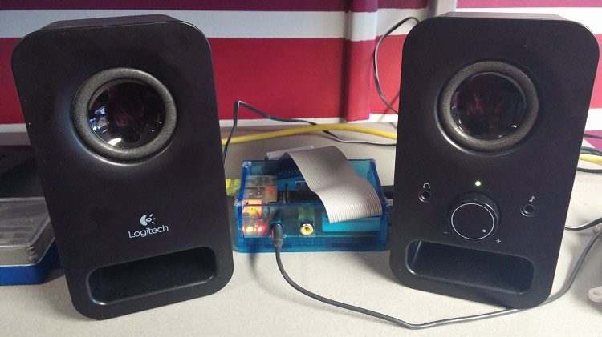

title: RIT Computer Science House
description: A collection of students interested in creating projects and learning new things.
template: template.html
siteroot: ../..

---

# RIT Computer Science House
CSH is a collection of students interested in creating projects and learning new things. The open and accepting community along with the highly available resources here create a learning environment that is unmatched anywhere else. I have begun working on various personal projects here.

# OpenGL/OpenCV Demo
{style="width:100%;display:block;"}

* Learned fundamental concepts of OpenGL as part of a 24 hour hackathon.
* Uses OpenCV to capture from a webcam and output to a OpenGL texture.
* Tracks squares of a certain color using OpenCV and moves OpenGL objects accordingly.
* Intended to be a proof of concept for a virtual environment for tabletop games.

## Source Code:
<a target="_blank" href="https://github.com/wastevensv/ARDnD"><i class="fa fa-github"></i>wastevensv/ARDnD</a> 

# Network Intercom System
{style="width:100%;display:block;"}

* Allows members to broadcast messages to any speaker system in the house.
* Created in collaboration with [Trevor Sherrard](http://trevorsherrard.com/){target="_blank"}.
# Source Code:
<a target="_blank" href="https://github.com/wastevensv/intercom"><i class="fa fa-github"></i>wastevensv/intercom</a> 

# Project Management System
{style="width:100%;display:block;"}

* Custom project management system written in Django.
* Used by members of the RIT Computer Science House to record and document projects.
## Source Code:
<a target="_blank" href="https://github.com/wastevensv/CSH_Projects"><i class="fa fa-github"></i>wastevensv/CSH_Projects</a> 
