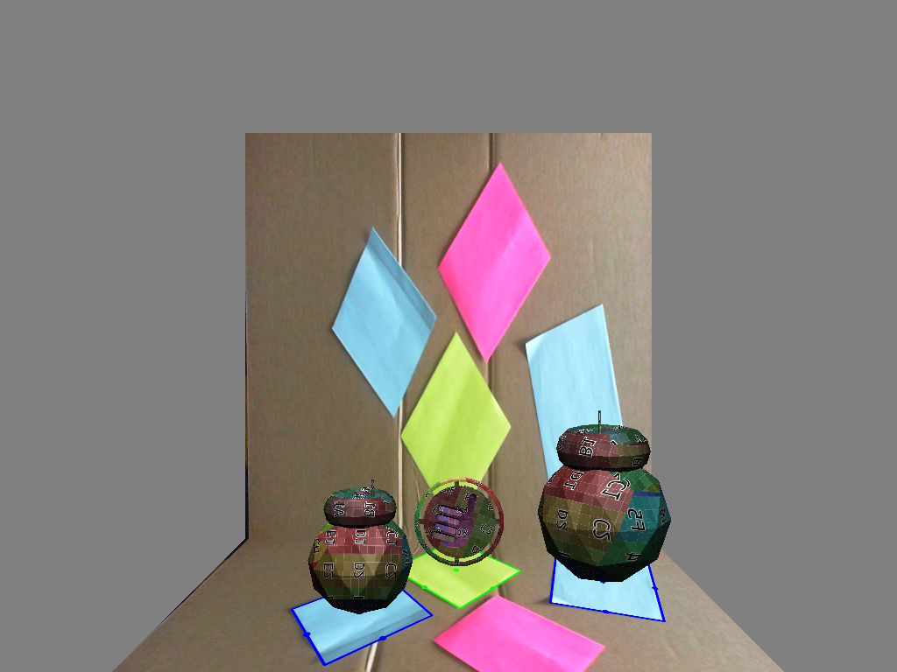

title: CSH
template: template.html
siteroot: ../..

---

<h1>RIT Computer Science House</h1>

CSH is a collection of students interested in creating projects and learning new things. The open and accepting community along with the highly available resources here create a learning environment that is unmatched anywhere else. I have begun working on various personal projects here.

    <h1>OpenGL/OpenCV Demo</h1>
    
    
   Learned fundamental concepts of OpenGL as part of a 24 hour hackathon.

    
   Uses OpenCV to capture from a webcam and output to a OpenGL texture.

    
   Tracks squares of a certain color using OpenCV and moves OpenGL objects accordingly.

    
   Intended to be a proof of concept for a virtual environment for tabletop games.

    <h2>Source Code:</h2>
    <a target="_blank" href="https://github.com/wastevensv/ARDnD"><i class="fa fa-github"></i>wastevensv/ARDnD</a> 

    <h1>Network Intercom System</h1>
    
    
   Allows members to broadcast messages to any speaker system in the house.

    
     Actively expanding project, exploring additional ways to convey messages.

    
   Created in collaboration with <a href="http://trevorsherrard.com/" target="_blank">Trevor Sherrard</a>.

    <h2>Source Code:</h2>
    <a target="_blank" href="https://github.com/wastevensv/intercom"><i class="fa fa-github"></i>wastevensv/intercom</a> 

    <h1> Project Management System</h1>
    
    
   Custom project management system written in Django.

    
   Used by members of the RIT Computer Science House to record and document projects.

    <h2>Source Code:</h2>
    <a target="_blank" href="https://github.com/wastevensv/CSH_Projects"><i class="fa fa-github"></i>wastevensv/CSH_Projects</a> 

