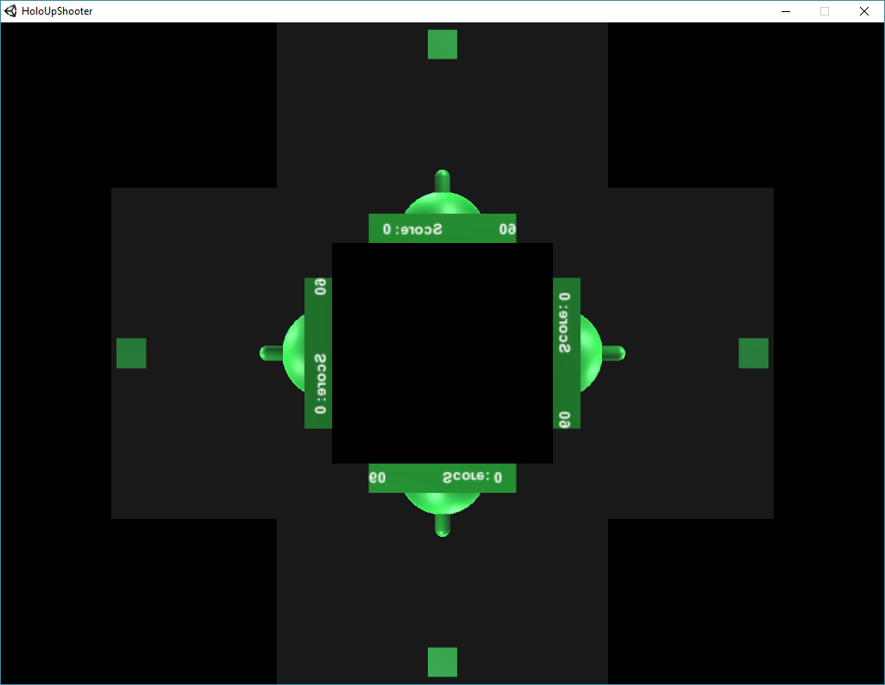

title: Holo
template: template.html
siteroot: ../..

---

# 'Holographic' Projection
{style="max-width:200pt;display:block;"}

I've seen a lot of tutorials online about how to make a phone sized reflective prism for projecting 'holograms' (not technically a [hologram](http://www.merriam-webster.com/dictionary/hologram){target="_blank"}, but creates the illusion of one). However, they were too small to be very interesting, and I couldn't find any software to render a object properly. As a result, I created a 4-sided reflective prism from 8"x10" Lexan sheets, and wrote software to render an object in the proper perspectives.

# Links
<a target="_blank" href="prism-calc.html"><i class="fa fa-link"></i>Reflective Prism Calculator</a> 
<a target="_blank" href="https://hackaday.io/project/14367-holographic-projection"><i class="fa fa-link"></i>Hackaday.io Project</a> 

# Software
## Holo UpShooter
{style="width:100%;display:block;"}

* Demos potential for interactive game-play on reflective prism.
* Both players must cooperate to aim from different perspectives.
* <a target="_blank" href="https://github.com/wastevensv/HoloUpShooter"><i class="fa fa-github"></i>wastevensv/HoloUpShooter</a>
* <a target="_blank" href="http://holo.wasv.me/UpShooter/"><i class="fa fa-link"></i>Web Based Build</a>

## Holographic Graphing
{style="width:100%;display:block;"}

* Procedurally generated mesh from a 3D equation.
* Used to visualize surfaces for my multi-variable calculus course.
* Made [an asset package](HoloRenderer.unitypackage) containing reflective prism rendering prefab.

## OpenGL Rendering Software
{style="width:100%;display:block;"}

* Uses multiple glViewports to render the object onto the same screen from different perspectives.
* Normalizes the size of an object to properly fit on the screen.
* Adjustable distance and rotation.
* <a target="_blank" href="https://github.com/wastevensv/Holo"><i class="fa fa-github"></i>wastevensv/Holo</a>
* <a target="_blank" href="http://holo.wasv.me/Demo/"><i class="fa fa-link"></i>Unity Web Based Demo</a>
* <a target="_blank" href="http://holo.wasv.me/WebGL/square/"><i class="fa fa-link"></i>WebGL Based Demo</a>
