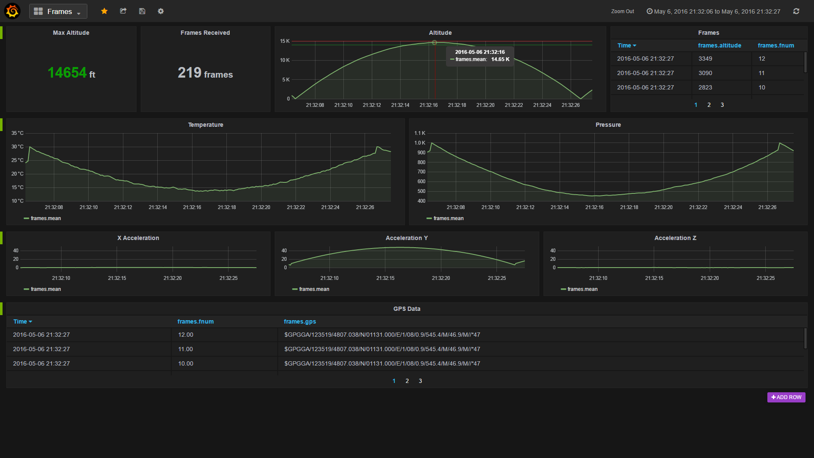

title: RIT Launch Initiative
description: A team of college students designing a 12 foot rocket and launching it 10,000 feet into the air.
template: template.html
siteroot: ../..
image: /img/launch.png

---

# RIT Launch Initiative
As a member of the RIT Launch Initiative, I have been working to develop the communications software for retrieving and analyzing data from a 12 foot rocket that will be launched 10,000 feet into the air.

  <iframe width="560" height="315" src="https://www.youtube.com/embed/Ku64EFfmUJA" frameborder="0" allowfullscreen></iframe>

## ZCM Transport Layer for Embedded Character Devices
{style="width:100%;display:block;"}

* A transport layer for the [ZCM Communication Framework](https://github.com/ZeroCM/zcm){target="_blank"} used to write messages over a standard POSIX character device.
* Can be used to communicate between the two devices, independent of how the devices are connected.
* Provides a standard way to communicate telemetry data from the RTOS on the rocket to the ground control PC.

## [Influxdb](https://influxdata.com/){target="_blank"} / [Grafana](http://grafana.org/){target="_blank"} Data Analytics System
{style="width:100%;display:block;"}

* Used to provide a flexible way to visualize data sent from the rocket in near-realtime.
* Installed and configured as a system for demo and testing purposes.
* Uses modern web technologies to provide an easily accessible system.
