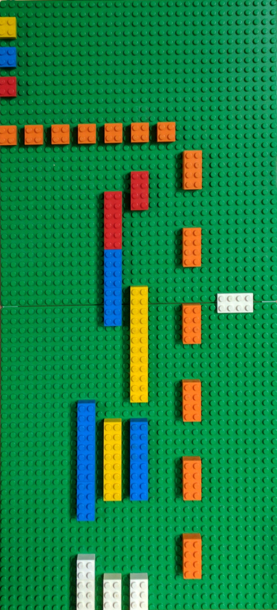

title: Playing with LEGOs and Working with OpenCV
description: Detecting and cropping LEGO backplanes using OpenCV.
template: template.html
siteroot: ../..
image: /img/lego-warp.png

---

# Playing with LEGOs and OpenCV
Detecting and cropping LEGO backplanes using OpenCV.

{class="primary" style="width:80%;display:block;"}

<i class="fa fa-gitlab"></i> Code: <a target="_blank" href="https://gitlab.com/wasv/lego-warp">wasv/lego-warp</a>

I've always loved playing with LEGOs. Some of my earliest memories involve building imaginary robots out of LEGOs on a big red table. Eventually I started building working robots with a LEGO Mindstorm NXT kit that my parents got me. And now I'm at RIT for computer engineering looking for ways to build real robots. Even though I'm at college, I'm still in the 4-99 year old range that is perfect for playing with LEGOs. Although now I've found more organized uses for LEGOs.

One of the ways I've been putting my LEGOs to use is a color-coded LEGO schedule. I can quantify the amount of time I spend on something by looking at how much of each color LEGO is on the calendar. Because it's made of LEGOs, my schedule is always malleable. I can move a block around to account for anything unexpected. However, since every block needs to go somewhere, I can make sure that I'm take the time I need for each project.

However, I find it difficult to keep up with a schedule if I can't see it. Since my LEGO schedule isn't exactly portable, I made a way to automatically crop and correct a photo of my calendar to just show the bricks. I used OpenCV to filter, detect, and warp the images.

  
  
  

    An example of a picture of my schedule, and the output of my program.
  

An overview of my thought process started with finding an effective way to filter out only the green color of the LEGO backplane. Then I used some code from an OpenCV tutorial to find the largest blob of that color. After that, I came up with a simple way to approximate the four corners of the backplane. Using those four corners as anchor points, I can finally use the OpenCV perspective warp function to fit the backplane into it's own image.

Eventually I may look into a way to digitize these images into a format that I can add to a calendar app. But for now, I'm just going to keep playing with LEGOs.

## 2017-05-05 Update: Can Detect Brick Colors

Recently I added another program to the repository for this project. This program takes in the output of the previous program, and uses hue and saturation histograms to categorize each cell by color. I'm going to put this project on hold for a while at this point.

