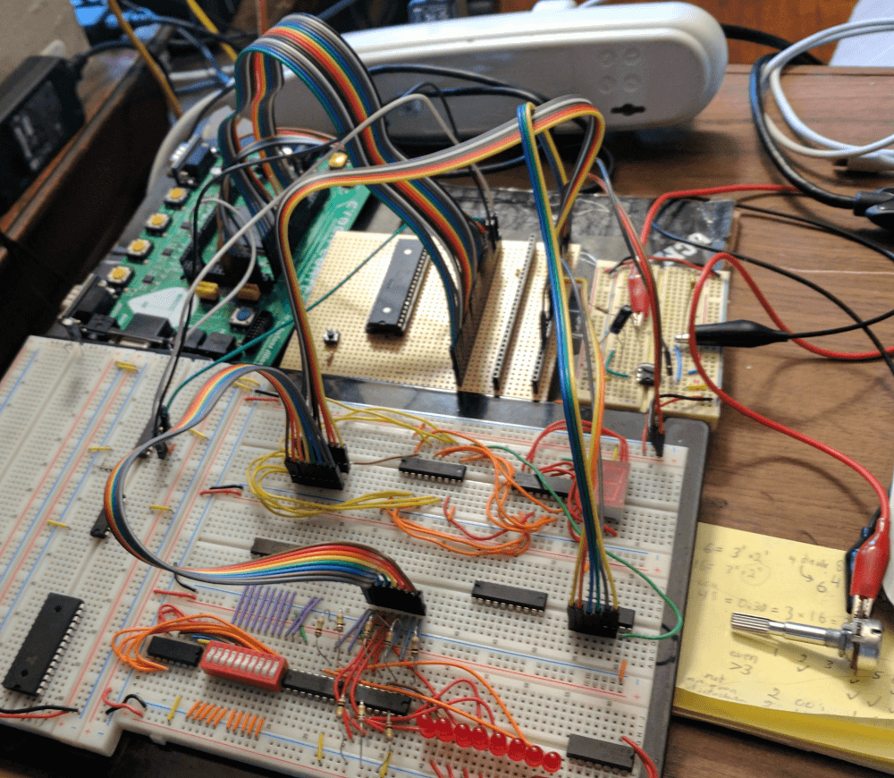

title: wz80
description: The start of a z80 retrocomputer.
template: template.html

---

{class="primary" style="width:80%;display:block;"}

One of the projects I was working on over a few weeks in spring of 2017 was a z80 homebrew computer. I call it [wz80](https://github.com/wastevensv/wz80){target="_blank"}, short for wasv's z80. Most of the construction of the computer was done during one of [CSH](https://csh.rit.edu/){target="_blank" title="Computer Science House"}'s weekend hackathon. Although, I designed the schematics a few days ahead of time.

The layout and modular design is based on Semachthemonkey's [RC2014](http://rc2014.co.uk/){target="_blank"} project. However, instead of building a separate backplane and CPU boad, I put the CPU and reset button on the backplane.

I left room to add a clock circuit in the future. Currently the clock signal is generated by a 555 timer. This makes debugging the hardware much easier. I actually managed to debug a program while it was running by attaching some LEDs to the data lines and turning the clock speed way down. I wrote down each byte as it appeared, and then disassembled the instructions by hand. In the end I had a working z80 computer that could cycle through the LEDs on a 7-segment display.

A few notes for anyone else who wants to build a homebrew computer:

* **Start small** This isn't the first time I wanted to build a homebrew computer. But it is the first time I managed to design and build one. I intentionally chose a good starting design, and stripped it down to the minimum set of necessary features.
* **One thing at a time.** Freerun the CPU first, then add a ROM, then basic IO, then RAM.
* **Know how you will be storing programs.** I ordered a few inexpensive flash chips without realizing how expensive flash programmers were. As a result, [I tried to make my own](https://github.com/wastevensv/wz80/tree/master/flashprog){target="_blank"} then ended up using [a FPGA as a ROM](https://github.com/wastevensv/wz80/tree/master/rom-core){target="_blank" } instead.
* As one of my engineering professors said, **"don't draw more lines in the morning than you can erase in the afternoon."** I'd like to add that after 8 PM counts as morning.
 
I made a change to my reset circuit around 8 PM, and soldered it later than night. By the time I finished assembling the board around 1 AM, I spent another two hours trying to figure out why all the outputs were being held high. After looking at the datasheet, I realized the issue was that change I added.
